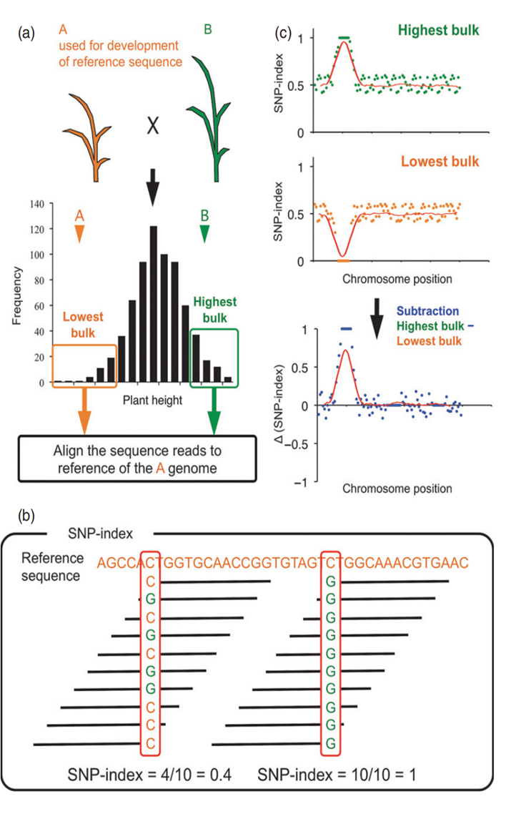

## 1.2.1 BSA简介

&emsp;&emsp;BSA（Bulked Segregant Analysis），即混合分组分析法，是一种利用极端性状进行功能基因定位的一种方法。具体过程为挑选两组具有极端性状的个体，分别混池后测序，然后计算多态性位点（一般用 SNP位点）的等位基因频率（allele frequency）。等位基因频率有显著差异的多态性位点区域，即是控制目标性状的基因所在的染色体区段。BSA 的基本原理如下图：

